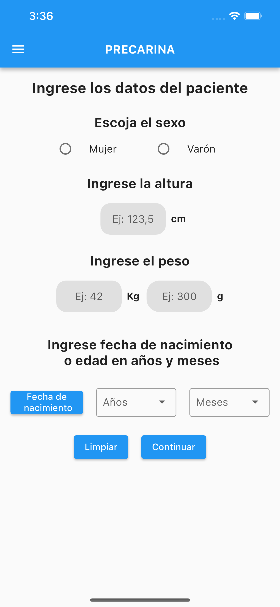
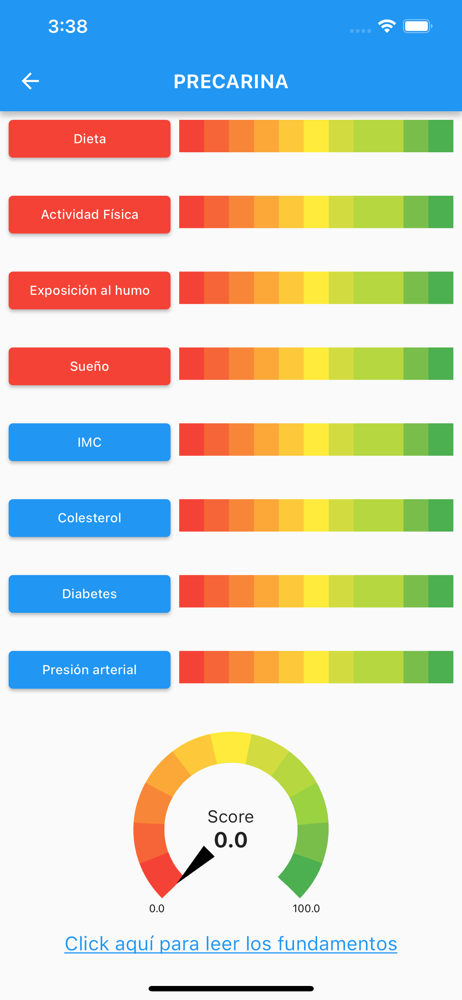

# precarina

Esta app es una customización de SACARINA para los valores y costumbres correspondientes a la Argentina.

INFORMACION SOBRE LA APP

Sugerimos que para la práctica clínica pediátrica y especialmente las edades más jóvenes, CVH (Cardiovascular Health) sea considerado principalmente como una herramienta para evaluar y promover un estilo de vida saludable. La puntuación formal es opcional y los médicos deben tener cuidado al discutir CVH con la familia para enfatizar los conceptos y el bienestar de por vida y no el puntaje específico, dada la escasez de datos para respaldar un marco de puntuación. Esto es parte teorica de fundamentación para tener a mano Numerosos estudios han demostrado que la CVH total en la infancia, comenzando al menos alrededor de los 8 años (el edad más joven investigada) se asocia con ECV subclínica en la mediana edad un estudio reciente examinó varias métricas individuales (IMC, PA, colesterol total, triglicéridos y tabaquismo) a edades 3-19 años entre 38 589 participantes con un seguimiento medio de 35 años, lo que documenta que un promedio de los puntajes z métricos, conceptualmente similar a un puntaje CVH total, se asoció fuertemente con riesgos ajustados para eventos CVD fatales y no fatales antes de los 65 años. Los resultados de salud a corto y mediano plazo (incluido el seguimiento de las métricas en adolescencia y edad adulta) son lo suficientemente sólidas como para que la dieta, la actividad física (tiempo de pantalla y jugar), el sueño, la exposición al humo de segunda mano y el peso corporal son objeto de atención y consejería en visitas rutinarias de niño sano Especialmente las edades más jóvenes, CVH es considerado principalmente como una herramienta para evaluar y promover un estilo de vida saludable. La capacidad para estratificar el riesgo cardiometabólico a largo plazo a través de un espectro de niveles es menos seguro en este grupo de edad (menos en niños <2-3 años de edad ), aunque aún podrían ser introducidos conceptualmente a los padres como parte de la motivación para establecer y mantener hábitos saludables desde una edad temprana

