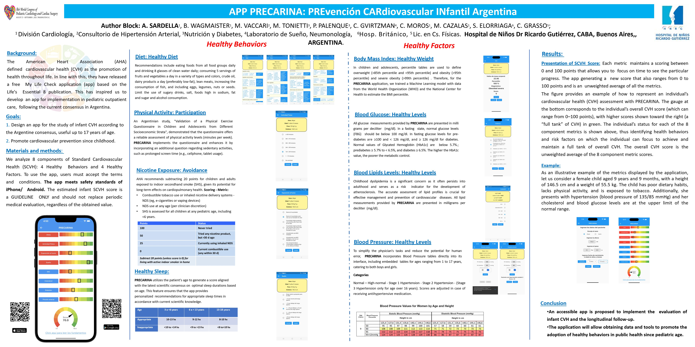

# PRECARINA 

## INTRODUCTION  

PRECARINA was presented as a poster at the [8th World Congress of Pediatric Cardiology and Cardiac Surgery:]
(https://www.wcpccs2023.org/event/1da8563e-0f65-486c-88df-70c3db431af5/summary)

  

PRECARINA can be found among the presented research works at: https://www.wcpccs2023.org/event/1da8563e-0f65-486c-88df-70c3db431af5/websitePage:f3433ae0-cdc1-47f9-bfa9-9fdc490f09d9  where it is mentioned as:

ANGELA SARDELLA | App PRECARINA: **PRE**vención **CAR**diovascular **IN**fantil **A**rgentina | Wednesday | Poster Area 1 - Board # 1113 | Global Cardiac Health

  

It can be downloaded for free in both PayStore and AppStore:

  
  

## MEDICAL INFORMATION

We suggest that for pediatric clinical practice, especially for younger ages, CVH (Cardiovascular Health) be primarily considered as a tool to assess and promote a healthy lifestyle. Formal scoring is optional, and doctors should be cautious when discussing CVH with the family to emphasize lifelong concepts and well-being rather than specific scores, given the limited data to support a scoring framework. This is part of the theoretical foundation to have on hand. Numerous studies have shown that total CVH in childhood, starting at least around 8 years old (the youngest age investigated), is associated with subclinical CVD in middle age. A recent study examined various individual metrics (BMI, blood pressure, total cholesterol, triglycerides, and smoking) at ages 3-19 years among 38,589 participants with an average follow-up of 35 years, which documented that an average z-score, conceptually similar to a total CVH score, was strongly associated with adjusted risks for fatal and non-fatal CVD events before the age of 65.

The short and medium-term health outcomes (including tracking metrics in adolescence and adulthood) are strong enough for diet, physical activity (screen time and play), sleep, exposure to secondhand smoke, and body weight to be addressed and counseled during routine visits for healthy children. Especially for younger ages, CVH is primarily considered as a tool to assess and promote a healthy lifestyle. The ability to stratify long-term cardiometabolic risk across a spectrum of levels is less certain in this age group (less in children <2-3 years old), although it could still be introduced conceptually to parents as part of the motivation to establish and maintain healthy habits from an early age.
  
  ## TECHICAL STUFF
  
 PRECARINA is a 100% Flutter app but for the Body Mass Index (BMI) Module a Tensor Flow model was trained to estimate BMI percentiles. To that end, the following graphs were used to determine the values used to train the model:

XXX AGREAGAR GRAFICOS

The training was made using Python by means of a Jupyter Notebook project (XXX AGREGAR REFERENCIA)

 

